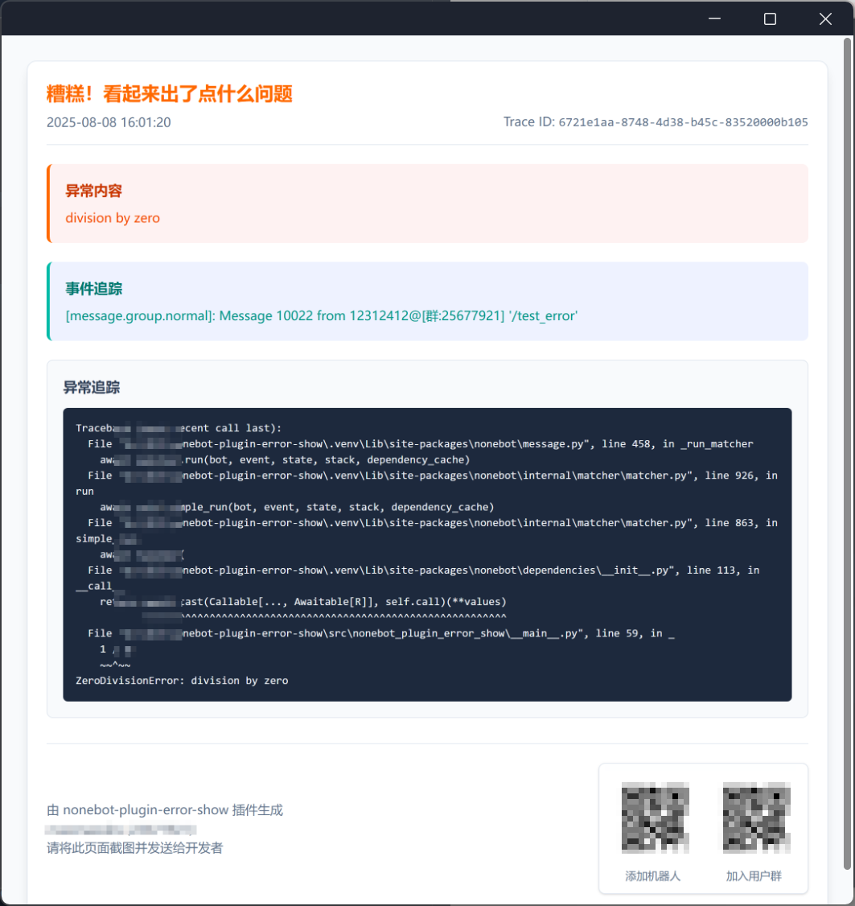

    

## ✨ 错误可视化插件 ✨

## 📖 介绍

非侵入式的错误可视化插件, 可以将运行中的错误以图片的形式发送到聊天窗口, 方便调试、排查问题和用户反馈。

## 💿 安装

使用 nb-cli 安装

在 nonebot2 项目的根目录下打开命令行, 输入以下指令即可安装

    nb plugin install nonebot-plugin-error-show --upgrade
使用 **pypi** 源安装

    nb plugin install nonebot-plugin-error-show --upgrade -i "https://pypi.org/simple"
使用**清华源**安装

    nb plugin install nonebot-plugin-error-show --upgrade -i "https://pypi.tuna.tsinghua.edu.cn/simple"

使用包管理器安装

在 nonebot2 项目的插件目录下, 打开命令行, 根据你使用的包管理器, 输入相应的安装命令

uv

    uv add nonebot-plugin-error-show
安装仓库 master 分支

    uv add git+https://github.com/zifox666/nonebot-plugin-error-show@master

pdm

    pdm add nonebot-plugin-error-show
安装仓库 master 分支

    pdm add git+https://github.com/zifox666/nonebot-plugin-error-show@master

poetry

    poetry add nonebot-plugin-error-show
安装仓库 master 分支

    poetry add git+https://github.com/zifox666/nonebot-plugin-error-show@master

打开 nonebot2 项目根目录下的 `pyproject.toml` 文件, 在 `[tool.nonebot]` 部分追加写入

    plugins = ["nonebot_plugin_error_show"]

## ⚙️ 配置

在 nonebot2 项目的`.env`文件中添加下表中的必填配置，将在错误信息最下面显示

|       配置项        | 必填 | 默认值 |     说明     |
|:----------------:|:--:| :----: |:----------:|
|    E_BOT_LINK    | 否  |   无   | 加BOT好友的链接  |
| E_BOT_GROUP_LINK | 否  |   无   | 加BOT服务群的链接 |
|     NICKNAME     | 否  |   无   |   BOT名称    |

## 🎉 使用
### 指令表
|          指令          |  权限   | 需要@ | 范围 |       说明       |
|:--------------------:|:-----:|:---:|:--:|:--------------:|
|      sub_error       | SUPER |  否  | 所有 |   所有异常发当前会话    |
|     sub_error r      | SUPER |  否  | 所有 |   移除当前会话异常接收   |
| get_error <trace_id> | SUPER |  否  | 所有 | 获取指定trace_id详情 |
|test_error <trace_id> | SUPER |  否  | 所有 |     测试异常发送     |

### 🎨 效果图

